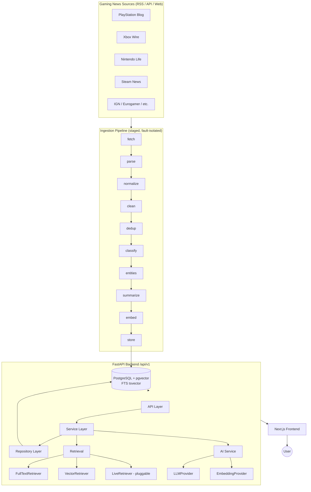
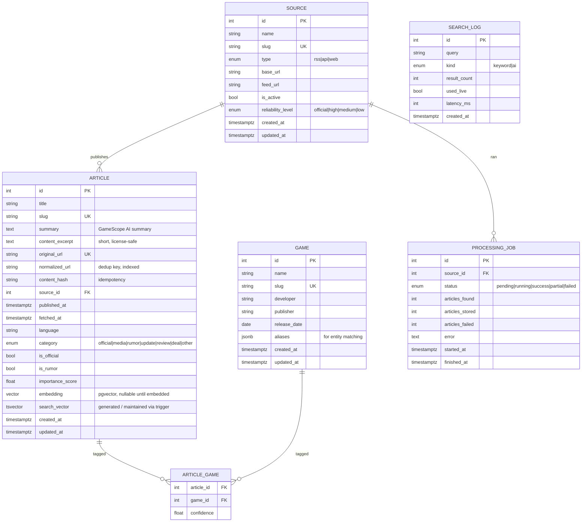
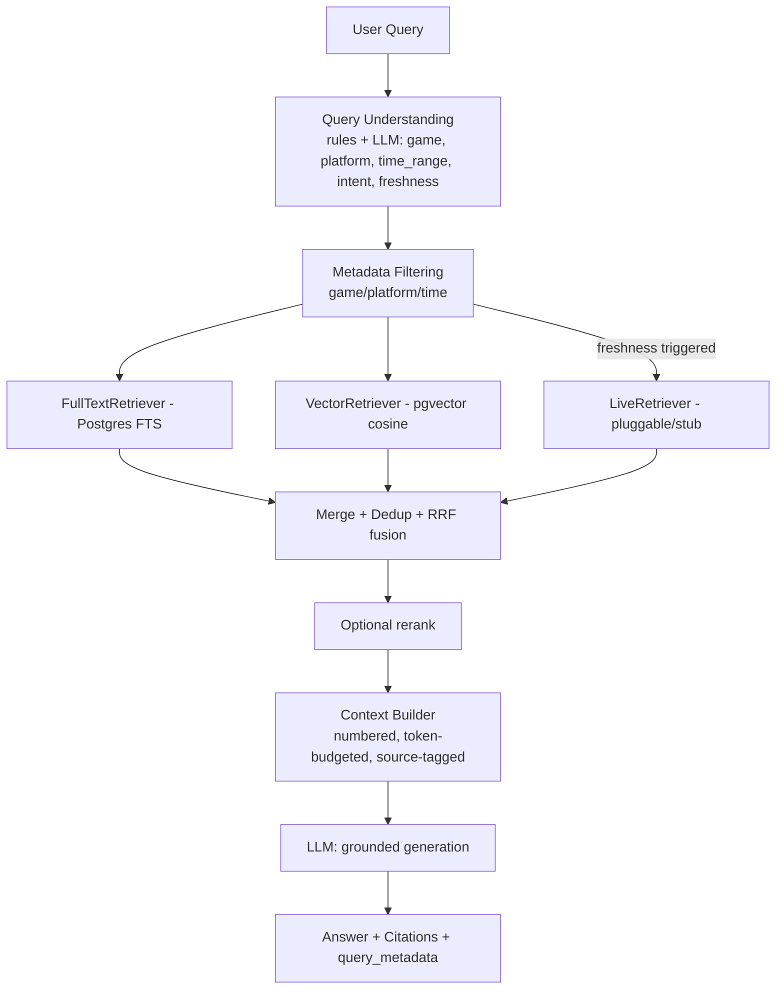

# ARCHITECTURE.md — GameScope

This document is the technical source of truth. It records the **scope review**, the **final tech stack**,
the **design** (DB, API, pipeline, retrieval, AI search, frontend IA, deployment), and the
**engineering-decision rationale** (interview-facing "why" questions).

---

## 0. Professional Scope Review (Lead Engineer sign-off)

The provided brief is well-scoped. I reviewed it for over-engineering and architectural risk. My adjustments:

| # | Area | Brief | Decision | Reason |
|---|---|---|---|---|
| 1 | Async worker / queue | "redis + worker if needed" | **Defer.** Ingestion runs as a CLI/cron job + an admin-triggered endpoint. No Celery/Redis in v1. | A queue solves a scaling problem we don't have. A single ordered pipeline run is simpler to explain and test. Redis is added only if we add scheduled concurrency — documented as Future Work. |
| 2 | LLM/Embedding providers | "OpenAI/DeepSeek/Qwen" | **One abstraction + 2 concrete impls: an OpenAI-compatible provider and a deterministic local provider.** | The abstraction is the point (interface + factory + env config). A local, dependency-free provider makes the whole system **run and be tested with no API key**, which is a strong reliability story. DeepSeek/Qwen are OpenAI-compatible, so they drop into the same provider via `LLM_BASE_URL`. |
| 3 | Reranking | "Reranker" | **Reciprocal Rank Fusion (RRF)** for hybrid fusion; optional cross-encoder/LLM rerank behind an interface but off by default. | RRF is parameter-light, explainable, and needs no extra model. A learned reranker is a latency/cost trade-off we document but don't force. |
| 4 | Live web retrieval | "can do it" | **Interface + a null/stub provider by default; real provider pluggable.** | Keeps the retrieval contract clean and testable; avoids binding the business to one search vendor. A real provider (e.g. Tavily/Bing) can be dropped in via config. |
| 5 | Entity extraction | "identify game entities" | **Alias dictionary + fuzzy match first; LLM only as fallback for unmatched.** | Deterministic, fast, testable, cheap. Most gaming titles are matched by a curated alias table. LLM handles the long tail. Matches the brief's "rules + LLM" guidance and §45 (don't use LLM where code suffices). |
| 6 | Dedup | multiple signals | **v1 = normalized-URL exact match + title trigram similarity; embedding-similarity dedup is a later refinement.** | Cheapest signals with the best ROI. Embedding dedup requires embeddings to exist first and adds cost — deferred. |
| 7 | Summaries/embeddings idempotency | performance §37 | **Content hash gates re-summarize/re-embed.** | Avoids repeat LLM/embedding calls on re-ingest — real cost control, easy to explain. |

Everything else in the brief is accepted as-is. No unrequested scope was added.

---

## 1. System Overview



## 2. Final Tech Stack

| Layer | Choice | Version target |
|---|---|---|
| Frontend | Next.js (App Router) + TypeScript + Tailwind CSS + shadcn-style components | Next 14/15, React 18/19 |
| Backend | Python + FastAPI + Pydantic v2 + SQLAlchemy 2 (async) | Python 3.11+, FastAPI ≥0.110 |
| DB | PostgreSQL 16 + `pgvector` + native FTS (`tsvector`, GIN) + `pg_trgm` | pg16, pgvector 0.7+ |
| Migrations | Alembic | latest |
| Ingestion | `httpx` (async) + `feedparser` + `selectolax`/`beautifulsoup4` | — |
| AI | Provider abstraction: OpenAI-compatible (OpenAI/DeepSeek/Qwen via base_url) + deterministic local fallback | — |
| Infra | Docker + docker compose | compose v2 |
| CI | GitHub Actions | — |
| Tests | pytest (+ httpx AsyncClient), frontend lint/typecheck/build | — |

**Rationale summary** (details in §12):
Postgres unifies relational + FTS + vector in one store (no polyglot persistence); FastAPI gives async I/O
and first-class OpenAPI; a strict frontend/backend split keeps the API reusable; hybrid search beats either
retriever alone; RAG (not fine-tuning) is correct for fresh, attributable facts.

## 3. Backend Architecture (layers)

```
API Layer (FastAPI routers)        # HTTP, validation, status codes, error mapping, pagination
   │  depends on
Service Layer                      # business logic, orchestration, transactions
   │  depends on
Repository Layer                   # data access, queries, no business logic
   │
Database (PostgreSQL)
```

Cross-cutting: `core/config` (settings), `core/logging` (structured + request IDs),
`core/errors` (unified error model + exception handlers), `core/pagination`.

Sub-systems:

- **AI** — `ai/llm/*` (LLMProvider + OpenAI-compatible + local), `ai/embedding/*` (EmbeddingProvider + impls),
  `ai/query_understanding.py`, `ai/rag.py`, `ai/prompts.py`.
- **Retrieval** — `retrieval/base.py` (Retriever protocol + `RetrievedDoc`), `fulltext.py`, `vector.py`,
  `live.py` (stub), `hybrid.py` (RRF), `rerank.py`.
- **Ingestion** — `ingestion/sources/*` (Provider pattern: RSS/API/Web), `ingestion/stages/*`
  (one function per stage), `ingestion/pipeline.py` (orchestrator), `ingestion/runner.py` (CLI entry).

DI: FastAPI's `Depends` provides the DB session and constructs services/repositories per request.
Providers (LLM/embedding/retrievers) are built from settings via small factories — simple and testable.
Where a plain function is clearer than a class (e.g. pipeline stages, normalizers), we use a function.

## 4. Database Design



**Indexes / constraints:**

- `article.normalized_url` UNIQUE (dedup), `article.slug` UNIQUE, `article.original_url` UNIQUE.
- GIN index on `article.search_vector` (FTS); `pg_trgm` GIN on `article.title` (title-similarity dedup + fuzzy search).
- `ivfflat`/`hnsw` index on `article.embedding` (cosine) — created in a migration, populated after embeddings exist.
- B-tree on `article.published_at`, `article.source_id`, `article.category`.
- `article_game` composite PK `(article_id, game_id)`.
- `created_at` / `updated_at` on all mutable tables (server defaults + `onupdate`).

**Why these tables and not more:** `ProcessingJob` and `SearchLog` earn their place (observability + the
`/system` page uses them). No table exists purely to look complex.

## 5. REST API (versioned `/api/v1`)

| Method | Path | Purpose |
|---|---|---|
| GET | `/api/v1/health` | Liveness + DB/AI/search readiness |
| GET | `/api/v1/news` | Paginated list; filters: `platform`, `category`, `source`, `game`, `q`; sort: `latest`/`importance` |
| GET | `/api/v1/news/{slug}` | Article detail + related articles |
| GET | `/api/v1/games` | List games |
| GET | `/api/v1/games/{slug}` | Game detail |
| GET | `/api/v1/games/{slug}/news` | News for a game |
| GET | `/api/v1/search` | Traditional search (FTS over title/summary/game/category) |
| POST | `/api/v1/ai/search` | **RAG**: grounded answer + sources + query metadata |
| GET | `/api/v1/trending` | Trending/featured games (by recent article volume + importance) |
| GET | `/api/v1/system/stats` | Real pipeline stats for `/system` page |
| GET | `/api/v1/system/jobs` | Recent processing jobs |

**AI Search request/response:**

```jsonc
// POST /api/v1/ai/search
{ "query": "What happened with GTA VI this week?", "language": "en" }

// 200
{
  "answer": "…grounded prose with [1][2] citations…",
  "sources": [
    { "index": 1, "title": "…", "source": "Rockstar", "url": "https://…", "published_at": "…", "is_official": true }
  ],
  "related_articles": [ { "slug": "…", "title": "…" } ],
  "query_metadata": {
    "game": "Grand Theft Auto VI", "platform": null, "time_range": "7d",
    "intent": "news_summary", "requires_freshness": true, "used_live": false,
    "retrieval": { "fts": 12, "vector": 15, "fused": 20, "reranked": 8 }
  },
  "generated_at": "2026-…Z"
}
```

**Quality:** Pydantic schemas everywhere, proper HTTP status codes, pagination envelope
(`{items, total, page, page_size}`), sorting/filtering query params, OpenAPI at `/api/docs` + `/api/redoc`.

## 6. Unified Error Model

```jsonc
{ "error": { "code": "AI_PROVIDER_UNAVAILABLE", "message": "AI search is temporarily unavailable.", "request_id": "…" } }
```

Codes: `INVALID_REQUEST`, `NOT_FOUND`, `RATE_LIMITED`, `NETWORK_ERROR`, `SOURCE_FETCH_FAILED`,
`ARTICLE_PARSE_FAILED`, `DATABASE_ERROR`, `SEARCH_ERROR`, `AI_PROVIDER_ERROR`, `AI_PROVIDER_UNAVAILABLE`,
`EMBEDDING_ERROR`, `INTERNAL_ERROR`. A single `AppError` base + FastAPI exception handlers map to the
right HTTP status. Users never see stack traces or raw 500s.

## 7. Data Ingestion Pipeline

Staged, each stage a pure-ish function `(ctx, items) -> items`, with **per-article fault isolation**:
a failure on one article is logged and skipped; the run continues and is marked `partial`.

```
FETCH → PARSE → NORMALIZE → CLEAN → DEDUP → CLASSIFY → ENTITIES → SUMMARIZE → EMBED → STORE
```

- **fetch** — via `NewsSource` provider (RSS/API/Web). Provider pattern; adding a source ≠ rewriting the pipeline.
- **parse** — provider-specific → common `RawItem`.
- **normalize** — canonical fields, `normalized_url` (strip tracking params, lowercase host), parsed timestamps, language guess.
- **clean** — strip HTML to safe excerpt, whitespace, boilerplate.
- **dedup** — normalized-URL exact + title trigram similarity vs recent DB rows.
- **classify** — official/media/rumor + category (rules on source reliability + keyword signals; LLM optional).
- **entities** — game linking via alias dictionary + fuzzy; LLM fallback for unmatched.
- **summarize** — LLM summary (skipped if `content_hash` unchanged). AI failure ⇒ store without summary.
- **embed** — EmbeddingProvider (skipped if unchanged). Failure ⇒ store without embedding; backfill later.
- **store** — upsert Article, link games, write `ProcessingJob`.

**Fault rule:** AI (summary/embed) failures never block basic ingestion. Articles are always storable with
metadata + excerpt + source + URL.

## 8. Hybrid Retrieval & AI Search



- **Hybrid ranking = RRF**: `score(d) = Σ 1/(k + rank_i(d))` over retrievers (k≈60). Simple, explainable, no extra model.
- **Freshness logic** (config-driven, `settings.freshness_*`): trigger live retrieval when the query has
  freshness keywords AND (top local result older than threshold OR too few local results). Thresholds are
  in config, not hard-coded.
- **Grounding**: the prompt (see `ai/prompts.py`) instructs the model to answer key facts **only** from
  numbered context, cite `[n]`, say "insufficient information" when unsupported, never invent dates/sources,
  distinguish rumor vs official, and flag source conflicts. Sources returned are exactly the retrieved docs used.
- **Never** `question → LLM → answer`. Retrieval is mandatory; if retrieval is empty, we say so.

## 9. Query Understanding

Extract `{game, platform, topic, time_range, intent, language, requires_freshness}`.
Rules first (alias dictionary for games/platforms, regex for time ranges like "this week"/"最近一周"→`7d`,
freshness keyword set), LLM fills gaps for ambiguous queries. Bilingual (en/zh). Falls back gracefully with
the local provider so AI Search works without an API key (deterministic extraction + extractive answer).

## 10. Frontend Information Architecture

```
/                 Home     — hero + AI search box, featured/trending, latest news
/news             News     — list + filters (Latest/PC/PS/Xbox/Nintendo, Official/Media/Rumor)
/news/[slug]      Detail   — title/source/time/original URL/AI summary/game/platform/category/related
/search           AI Search— query → retrieved sources → grounded answer (centerpiece)
/system           System   — "How GameScope Works": pipeline diagram, tech stack, real stats, health, recent jobs
/games/[slug]     Game     — game detail + its news (low-cost, high-value; included)
```

State handling on every data view: **loading**, **error**, **empty**. Dark-first, editorial + AI-product
aesthetic; restrained (no neon overload / heavy animation). API client in `src/lib/api.ts` (typed, single base URL).

## 11. Deployment

`docker compose up` starts: `postgres` (pgvector image), `backend` (FastAPI + Alembic migrate on start),
`frontend` (Next.js). Ingestion is run on demand (`docker compose run backend python -m app.ingestion.runner`)
or via the admin endpoint; seed data is loadable for a zero-key demo. `.env.example` documents all config;
no secrets in the repo. CORS restricted to the frontend origin.

## 12. Engineering Decisions ("Why") — interview-facing

- **Why PostgreSQL, not MongoDB?** The data is relational (articles↔sources↔games) and we need transactions,
  constraints, FTS, and vectors in one place. Postgres does all of it; Mongo would force app-side joins and
  a separate search/vector store.
- **Why pgvector (not a dedicated vector DB)?** One datastore, transactional consistency between metadata and
  vectors, no extra ops. At our scale (thousands–tens of thousands of docs) pgvector's ivfflat/hnsw is plenty.
  A dedicated vector DB is Future Work if scale demands it.
- **Why FastAPI?** Async I/O (we do concurrent HTTP fetches + DB), Pydantic validation, and auto OpenAPI/Swagger
  that lets an interviewer test the API immediately.
- **Why split frontend/backend?** The backend is the product; the API must be reusable by future App/Bot.
  A split also mirrors real production and keeps business logic out of the UI.
- **Why hybrid search?** FTS nails exact terms/names; vectors capture paraphrase/semantics. Fusing both (RRF)
  is more robust than either alone and is easy to explain and test.
- **Why not microservices?** One team, one deploy unit, shared models. Microservices would add network,
  data-consistency, and ops cost with no benefit at this scale. A clean layered monolith is the right call.
- **Why not Kafka?** No high-throughput streaming or multi-consumer fan-out. A staged batch pipeline + optional
  cron is sufficient and far easier to reason about.
- **Why RAG, not fine-tuning?** Facts are fresh and must be **attributable** to sources. RAG retrieves current,
  citable evidence; fine-tuning bakes in stale, unattributable knowledge and can't cite.
- **Why an LLM provider abstraction + local fallback?** Avoids vendor lock-in (DeepSeek/Qwen are OpenAI-compatible
  via base_url) and lets the system run + be tested with **no API key** — a real reliability property, not a trick.
